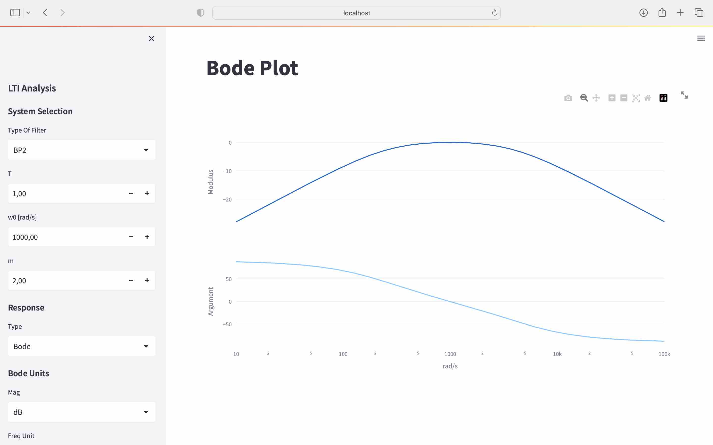

# Second Order System Analysis

This is a simple Streamlit application for analyzing second-order systems. The application allows users to specify system parameters and visualize different representations such as pole and zero maps, step responses, and Bode diagrams.



## Features

- **Pole and Zeros Map**: Visualizes the poles and zeros of the system in the complex plane.
- **Step Response**: Plots the system's step response, showing the system's behavior over time.
- **Bode Diagram**: Displays the Bode plot, representing the frequency response of the system.

## Getting Started

### Prerequisites

To run this application, you'll need to have Python installed on your system along with the following Python libraries:

- `streamlit`
- `numpy`
- `scipy`
- `matplotlib`

You can install the required dependencies using the following command:

```bash
pip install -r requirements.txt
```

### Folder Structure

```
second-order-system-analysis/
│
├── app                     # Folder containing the main application
├── README.md               # Project documentation
├── requirements.txt        # List of dependencies
└── requirements.txt        # List of dependencies
```


### Running the Application

To start the Streamlit application, use the following command:

```bash
cd app
streamlit run app.py
```

This will open a new tab in your web browser where you can interact with the application.